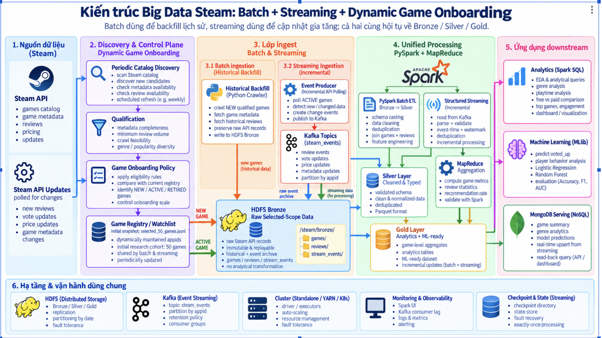

# BDA501 Steam Big Data Analytics

## Steam Game & Player Behavior Analytics with Recommendation Prediction

Đây là đồ án cuối kỳ môn **BDA501 - Big Data Analytics**.

Project xây dựng một kiến trúc Big Data end-to-end để thu thập, lưu trữ, xử lý, phân tích và khai thác dữ liệu game/review trên Steam.

Hệ thống kết hợp:

- Python để thu thập dữ liệu từ Steam
- HDFS cho distributed storage
- MapReduce cho distributed aggregation
- PySpark DataFrames và Spark SQL cho Data Engineering và Analytics
- Parquet cho curated data
- Kafka + Spark Structured Streaming cho incremental / near-real-time processing
- Spark MLlib cho Machine Learning
- MongoDB cho serving layer
- Cluster / Cloud architecture cho khả năng scale

> **Implementation status:** catalog discovery, qualification, initial 50-game selection, historical ingestion, validation, bronze-ready finalization, and HDFS Bronze verification are implemented. PySpark Bronze-to-Silver is the immediate next checkpoint. Dynamic registry automation, Kafka, Structured Streaming, MapReduce, Spark SQL/EDA, MLlib, and MongoDB serving remain planned or design-only unless later evidence states otherwise.

Tài liệu kiến trúc chi tiết bắt đầu tại [Project Overview](docs/00_PROJECT_OVERVIEW.md) và [Architecture](docs/01_ARCHITECTURE.md).

Machine Learning của project tập trung dự đoán:

```text
voted_up

true  -> 1 = Recommend
false -> 0 = Not Recommend
```

dựa trên **player behavior + game metadata**.

Model chính **không sử dụng `review` text**, do đó không tập trung vào NLP.

---

# 1. Problem Statement

Steam tạo ra dữ liệu liên tục về:

- games
- reviews
- recommendation behavior
- playtime
- purchase behavior
- votes
- price
- game metadata

Project giải quyết hai bài toán chính.

## 1.1 Big Data Analytics

Phân tích hành vi người chơi và đặc điểm game:

- Recommendation rate theo game
- Recommendation rate theo `genres`
- Playtime và recommendation behavior
- Free vs Paid games
- Review volume
- Game engagement
- Purchase / free-copy behavior

## 1.2 Machine Learning

Câu hỏi chính:

> Can player behavior and game characteristics be used to predict whether a Steam user recommends a game?

Target:

```text
voted_up

true  -> 1 = Recommend
false -> 0 = Not Recommend
```

---

# 2. Big Data Justification - 5V

## Volume

Development sample hiện tại:

```text
50 games
25,000 reviews
18,321 Positive
6,679 Negative
98 empty reviews
```

Dataset hiện tại là sample dùng để phát triển và kiểm chứng pipeline.

Kiến trúc được thiết kế để scale khi số game, review và event tăng lên quy mô lớn hơn.

HDFS được sử dụng cho distributed storage.

Parquet được sử dụng cho curated datasets nhằm hỗ trợ:

- columnar storage
- compression
- efficient analytical reads
- Spark processing

## Velocity

Dữ liệu Steam có thể thay đổi liên tục thông qua các event như:

```text
new_review
vote_update
price_update
game_metadata_update
```

Kafka và Spark Structured Streaming được thiết kế để xử lý incremental updates thay vì recompute toàn bộ dataset sau mỗi thay đổi.

## Variety

Project xử lý nhiều dạng dữ liệu:

```text
game metadata
review metadata
player behavior
numerical fields
boolean fields
categorical fields
timestamps
arrays
nested JSON
streaming events
```

## Veracity

Raw data có thể chứa:

```text
duplicate recommendationid
missing appid
missing metadata
empty review
invalid datatype
abnormal playtime
duplicate event
late event
```

Pipeline vì vậy cần:

- explicit schema
- validation
- deduplication
- type casting
- null handling
- key validation
- row-count reconciliation

## Value

Dữ liệu sau xử lý được sử dụng cho:

```text
player behavior analytics
game analytics
recommendation prediction
dashboard / reporting
MongoDB serving
near-real-time updates
```

---

# 3. End-to-End Architecture



Hình trên mô tả shared data lake và downstream platform. Phần flow dưới đây là source of truth mới cho discovery, registry và polling. “Steam events” là event do hệ thống tạo sau khi polling phát hiện thay đổi; Steam không được giả định cung cấp native push stream.

```text
Steam API
    |
Periodic Catalog Discovery
    |
Qualification
    |
Game Onboarding Policy
    |
Game Registry / Watchlist
    |
    +-- NEW ------> Historical Backfill ------> HDFS Bronze
    |
    +-- ACTIVE ---> Incremental API Polling
                        |
                  detect changes
                        |
                      Kafka
                    /       \
                   v         v
          Raw Event Archive  Structured Streaming
              HDFS Bronze             |
                                      v
                                   Silver

HDFS Bronze
    +-- PySpark Batch ETL -----------> Silver
    +-- MapReduce Aggregation -------+ validate against Spark

Silver -> Gold -> Spark SQL / MLlib / MongoDB
```

`selected_50_games.jsonl` là initial research snapshot cho experiment 50 game / 25,000 review, không phải giới hạn kiến trúc. Dynamic Registry / Watchlist cho phép onboarding game mới trong tương lai.

- **NEW game:** chạy historical backfill một lần, giữ raw API records và đưa vào HDFS Bronze.
- **ACTIVE game:** incremental polling, detect changes và tạo event. Không full recrawl ở mỗi discovery cycle.

Discovery/qualification là scope definition dựa trên metadata completeness, review availability/volume, crawl feasibility và diversity; không phải review cleaning/feature engineering và không dùng `voted_up` hoặc recommendation rate để chọn game.

Batch và Streaming **không phải hai hệ thống riêng biệt**. Cả hai hội tụ vào authoritative HDFS Bronze/Silver/Gold platform.

Cả hai cùng hội tụ vào data platform:

```text
Bronze
  |
Silver
  |
Gold
```

---

# 4. Batch Processing Path

Batch chịu trách nhiệm:

- historical ingestion
- backfill
- full recomputation
- schema migration
- cleaning-rule changes
- rebuild Silver / Gold

Flow:

```text
NEW qualified game
    |
Historical Backfill / Python Crawler
    |
HDFS Bronze
    |
PySpark ETL
    |
Silver Parquet
    |
Gold
```

Batch vẫn cần thiết ngay cả khi có Streaming.

Nếu business rule hoặc schema thay đổi, toàn bộ dataset có thể được rebuild lại từ Bronze.

Current 50-game historical backfill và HDFS Bronze đã hoàn thành. PySpark Bronze-to-Silver chưa hoàn thành và là checkpoint tiếp theo.

---

# 5. Streaming Processing Path (Planned / Design-only)

Streaming dự kiến xử lý dữ liệu mới hoặc thay đổi gần real-time. Steam API được polling cho các game `ACTIVE`; producer so sánh state và chỉ tạo event khi phát hiện thay đổi.

Flow:

```text
ACTIVE games
     |
Steam API Polling
     |
Detect Changes / Create Events
     |
Kafka
   /   \
  v     v
Raw Event Archive       Spark Structured Streaming
HDFS Bronze             -> validate/dedup/watermark/state
                        -> Silver / Gold incremental update
```

Các event dự kiến:

```text
new_review
vote_update
price_update
game_metadata_update
```

Event schema concept:

```text
event_id
event_type
event_time
appid
recommendationid
payload
```

Kafka topic dự kiến:

```text
steam_events
```

Partition key ưu tiên:

```text
appid
```

khi cần group các update của cùng game.

Kafka, event producer và Structured Streaming chưa được triển khai trong current repository.

---

# 6. Streaming Reliability (Design-only)

Đây là reliability design cho planned streaming component, không phải implemented evidence.

Hệ thống phải xử lý các vấn đề sau.

## 6.1 Schema Validation

Incoming JSON được parse bằng explicit schema.

Invalid events được chuyển sang rejected / bad-record path thay vì làm crash toàn bộ stream.

## 6.2 Deduplication

Ưu tiên sử dụng:

```text
event_id
```

hoặc business key phù hợp:

```text
recommendationid
+ event_type
+ event_time
```

## 6.3 Event-Time

Streaming sử dụng:

```text
event_time
```

để xử lý event theo thời điểm thực sự xảy ra.

## 6.4 Watermark

Watermark hỗ trợ xử lý late-arriving events và giới hạn lượng state phải giữ.

## 6.5 Stateful Processing

State có thể được sử dụng để cập nhật incremental metrics:

```text
review_count
positive_count
recommendation_rate
average_playtime
```

## 6.6 Checkpoint

Structured Streaming checkpoint lưu:

```text
source progress
offset information
state
recovery metadata
```

Nếu streaming job bị crash, Spark có thể tiếp tục từ checkpoint.

## 6.7 Idempotent Write

MongoDB hoặc downstream sink sử dụng key-based upsert.

Event bị replay không được tạo duplicate logical record.

---

# 7. Data Lake Architecture

Project sử dụng mô hình:

```text
Bronze
  |
Silver
  |
Gold
```

HDFS là authoritative Data Lake cho cả ba layer. `data/raw/` local chỉ là crawl/staging/backup; không được mô tả là authoritative Bronze/Silver/Gold.

## 7.1 Bronze Layer

Bronze giữ raw source-of-truth.

Ví dụ:

```text
games_raw.jsonl
reviews
review_pages
stream_events
```

Đặc điểm:

```text
raw
immutable
replayable
historical evidence
minimal transformation
```

Current HDFS Bronze đã được triển khai.

## 7.2 Silver Layer

Silver là dữ liệu:

```text
clean
typed
validated
deduplicated
normalized
```

Processing bao gồm:

```text
explicit schema
type casting
null handling
key validation
deduplication
timestamp conversion
normalization
```

Output dự kiến:

```text
Parquet
```

## 7.3 Gold Layer

Gold là dữ liệu business-ready.

Gold được chia thành hai nhóm chính.

### Gold Analytics

Ví dụ:

```text
genre recommendation rate
playtime bucket analytics
Free vs Paid analytics
game-level metrics
engagement metrics
```

### Gold ML-ready

Ví dụ:

```text
clean features
recommendation label
encoded categorical features
player behavior
game metadata
```

---

# 8. Current Dataset

Development dataset hiện tại:

```text
Games              : 50
Reviews            : 25,000
Positive voted_up  : 18,321
Negative voted_up  : 6,679
Empty reviews      : 98
```

Dataset hiện tại dùng để:

- development
- validation
- Spark pipeline design
- analytics
- ML experiments

Đây là fixed/versioned initial research cohort để reproduce EDA, ML và benchmark. Nó không phải permanent architecture limit; scalable design sử dụng dynamic Game Registry / Watchlist.

---

# 9. Games Dataset

Main fields:

```text
appid
name
developers
publishers
genres
categories
is_free
price_overview
platforms
release_date
```

Primary identifier:

```text
appid
```

---

# 10. Reviews Dataset

Main fields:

```text
recommendationid
appid
review
language
voted_up
timestamp_created
timestamp_updated
votes_up
votes_funny
weighted_vote_score
steam_purchase
received_for_free
playtime_forever
playtime_at_review
```

Primary identifier:

```text
recommendationid
```

Join:

```text
games.appid = reviews.appid
```

---

# 11. ETL with PySpark (Next / In Progress)

Bronze-to-Silver PySpark chưa được triển khai trong repository. Đây là exact next engineering checkpoint.

ETL:

```text
Extract
Transform
Load
```

Trong project:

```text
HDFS Bronze
      |
      | Extract
      v
PySpark DataFrame
      |
      | Transform
      v
Schema
Cleaning
Validation
Deduplication
Join
Derived Fields
      |
      | Load
      v
Silver / Gold Parquet
```

PySpark là primary processing framework của project.

---

# 12. Bronze to Silver (Next / In Progress)

Main pipeline:

```text
HDFS Bronze
    |
Explicit Schema
    |
Data Quality Validation
    |
Deduplication
    |
Type Casting
    |
Timestamp Conversion
    |
Key Validation
    |
Silver Parquet
```

Derived fields có thể bao gồm:

```text
playtime_hours
price
normalized genre
normalized platform
```

Example:

```text
playtime_hours
=
playtime_at_review / 60
```

---

# 13. Silver to Gold (Planned)

Silver reviews được enrich bằng Games metadata:

```text
reviews.appid
=
games.appid
```

Gold Base dự kiến chứa:

```text
appid
recommendationid
genres
categories
platforms
is_free
price
playtime_at_review
playtime_forever
playtime_hours
steam_purchase
received_for_free
voted_up
recommendation_label
timestamp_created
```

Derived fields:

```text
recommendation_label
playtime_bucket
price_bucket
```

---

# 14. MapReduce Component (Planned)

MapReduce dự kiến được sử dụng cho game-level review aggregation và được validate độc lập bằng PySpark.

Mapper:

```text
appid -> (1, voted_up, playtime_at_review)
```

Shuffle:

```text
group by appid
```

Reducer:

```text
review_count
positive_count
recommendation_rate
average_playtime
```

Output:

```text
appid
review_count
positive_count
recommendation_rate
average_playtime
```

MapReduce result sẽ được validate bằng PySpark:

```text
groupBy(appid)
```

với cùng metrics.

---

# 15. Spark SQL & EDA (Planned)

EDA chạy trên curated Silver / Gold datasets.

EDA không làm lại raw cleaning.

## Q1 - Recommendation Rate by Genre

```text
genre
review_count
positive_count
recommendation_rate
average_playtime
```

## Q2 - Playtime vs Recommendation

Playtime buckets:

```text
0-2 hours
2-10 hours
10-50 hours
50+ hours
```

Metrics:

```text
review_count
recommendation_rate
```

## Q3 - Free vs Paid

Compare:

```text
review_count
average_playtime
recommendation_rate
```

## Q4 - Game Engagement

Analyze:

```text
review_count
votes_funny
weighted_vote_score
average_playtime
```

EDA còn kiểm tra:

```text
voted_up class balance
playtime distribution
outliers
missing metadata
feature leakage
```

---

# 16. Spark Query Plan (Planned)

Ít nhất một analytical query sẽ được phân tích bằng:

```python
df.explain("formatted")
```

Các physical operators cần quan sát:

```text
Scan
Filter
Aggregate
Exchange
Shuffle
SortMergeJoin
BroadcastHashJoin
```

Query-plan evidence được lưu trong:

```text
evidence/
```

---

# 17. Machine Learning (Planned)

ML task:

```text
Binary Classification
```

Target:

```text
voted_up

true  -> 1
false -> 0
```

Primary model không sử dụng:

```text
review
```

text.

---

# 18. Machine Learning Features

## Player Behavior

```text
playtime_at_review
playtime_forever
steam_purchase
received_for_free
```

## Game Metadata

```text
is_free
price
genres
platforms
categories
```

Các field như:

```text
votes_up
weighted_vote_score
```

không được đưa vào primary prediction model nếu chúng tạo post-review leakage hoặc không phù hợp với prediction-time scenario.

---

# 19. PySpark ML Pipeline (Planned)

```text
Gold ML-ready Dataset
        |
StringIndexer
        |
OneHotEncoder
        |
VectorAssembler
        |
Train/Test Split
        |
+----------------------+
| Logistic Regression  |
+----------------------+
           VS
+----------------------+
| Random Forest        |
+----------------------+
        |
Evaluation
```

Train/Test split dự kiến:

```text
80% Train
20% Test
seed = 42
```

---

# 20. ML Evaluation

Evaluation metrics:

```text
Accuracy
Precision
Recall
F1-score
ROC-AUC
Confusion Matrix
```

Logistic Regression:

```text
linear baseline
fast
interpretable
```

Random Forest:

```text
nonlinear model
feature interactions
feature importance
```

Không kết luận model nào tốt hơn cho tới khi có measured results.

---

# 21. MongoDB Serving (Planned / Design-only)

MongoDB được thiết kế làm serving layer cho processed và model outputs; component này chưa được triển khai.

## Collection: game_summary

Key:

```text
appid
```

Fields:

```text
name
genres
review_count
positive_rate
average_playtime
last_updated
```

## Collection: genre_analytics

Key:

```text
genre
```

Fields:

```text
game_count
review_count
positive_rate
average_playtime
price_distribution
```

## Collection: model_predictions

Key:

```text
recommendationid
```

Fields:

```text
prediction
probability
model_version
prediction_time
```

Batch path:

```text
Gold
→ Spark
→ MongoDB upsert
```

Streaming path:

```text
Structured Streaming
→ foreachBatch
→ MongoDB upsert
```

---

# 22. Infrastructure

## HDFS

Responsibilities:

```text
Bronze storage
Silver storage
Gold storage
replication
distributed storage
raw replay
```

## Kafka

Status: **Planned / Design-only**.

Responsibilities:

```text
event ingestion
buffering
retention
partitioning
producer / consumer decoupling
```

## Spark Cluster

Status: deployment options documented; actual broader cluster deployment/performance evidence remains **Planned**.

Possible cluster managers:

```text
Standalone
YARN
Kubernetes
```

Execution concept:

```text
Driver
   |
Executors
   |
Partitions
```

---

# 23. Monitoring & Fault Tolerance

Monitoring / observability:

```text
Spark UI
driver logs
executor logs
Kafka consumer lag
MongoDB metrics
processing latency
```

Fault tolerance:

```text
HDFS replication
Kafka retention
Structured Streaming checkpoint
state recovery
idempotent MongoDB upsert
```

---

# 24. Scalability & Performance Experiments

Ít nhất một controlled experiment sẽ được chạy.

## Experiment A - Input Scale

```text
1x reviews
5x reviews
10x reviews
```

Measure:

```text
runtime
partitions
shuffle read
shuffle write
```

## Experiment B - Join Strategy

Compare:

```text
SortMergeJoin
vs
BroadcastHashJoin
```

## Experiment C - Streaming Micro-Batch

Compare:

```text
1-minute interval
vs
5-minute interval
```

Measure:

```text
latency
processedRowsPerSecond
state size
```

Chỉ measured experiment mới được ghi là implemented evidence.

---

# 25. Project Structure

```text
.
├── README.md
├── requirements.txt
├── .gitignore
│
├── config/
│
├── data/
│   ├── raw/
│   ├── bronze/
│   ├── silver/
│   └── gold/
│
├── evidence/
├── output/
├── scripts/
│
└── src/
    ├── common/
    ├── discovery/
    ├── selection/
    ├── ingestion/
    ├── validation/
    ├── hdfs/
    ├── mapreduce/
    ├── batch/
    ├── streaming/
    ├── analytics/
    ├── ml/
    └── serving/
```

---

# 26. Current Status

| Component | Status |
|---|---|
| Steam discovery | Done |
| Catalog qualification | Done |
| Initial 50-game research cohort | Done |
| Dynamic Game Registry / Watchlist automation | Design-only |
| Steam ingestion | Done |
| Raw-data validation | Done |
| Bronze-ready validation | Done |
| HDFS Bronze | Done |
| Project refactor | Done |
| PySpark Bronze -> Silver | **Next / In Progress** |
| Silver -> Gold | Planned |
| MapReduce aggregation | Planned |
| Spark SQL / EDA | Planned |
| Kafka / Structured Streaming | Planned |
| Spark MLlib | Planned |
| MongoDB Serving | Planned |
| Performance experiment | Planned |
| Cluster deployment design | Planned |
| Final report / demo | Planned |

---

# 27. Team Responsibilities

| Member | Primary Ownership |
|---|---|
| Bình | HDFS, MapReduce, Raw Validation |
| Khánh | PySpark Data Engineering, Streaming |
| Nghĩa | EDA, Spark SQL, Visualization, NoSQL |
| Huy | Machine Learning, Performance, Deployment |

Cross-checks được thực hiện ở integration checkpoints.

---

# 28. Git Workflow

Main branch:

```text
main
```

Feature branches:

```text
feature/binh-hdfs-mapreduce
feature/khanh-pyspark-streaming
feature/nghia-analytics-nosql
feature/huy-ml-performance
```

Development flow:

```text
Feature Branch
      |
      v
Pull Request
      |
      v
    main
```

Không phát triển feature mới trực tiếp trên `main`.

---

# 29. Python Environment

Current Python dependencies được lưu trong:

```text
requirements.txt
```

File hiện tại được tạo bằng:

```bash
python3 -m pip freeze > requirements.txt
```

Điều này có nghĩa `requirements.txt` phản ánh chính xác Python packages đang cài trong development environment tại thời điểm freeze.

Khi thêm PySpark, Kafka client, MongoDB client hoặc các package mới:

```text
install dependency
→ verify implementation
→ freeze requirements again
```

Không tự thêm version chưa được kiểm chứng.

---

# 30. Environment Setup

Create virtual environment:

```bash
python3 -m venv .venv
```

Activate:

```bash
source .venv/bin/activate
```

Install dependencies:

```bash
python3 -m pip install -r requirements.txt
```

Check:

```bash
python3 --version
java --version
```

Khi PySpark đã được cài:

```bash
python3 -c "import pyspark; print(pyspark.__version__)"
```

---

# 31. Data Policy

Large datasets không được commit lên Git.

Các path local / generated:

```text
data/raw/
data/bronze/
data/silver/
data/gold/
output/
```

Git repository chủ yếu chứa:

```text
source code
configuration
documentation
small evidence
schemas
analytical queries
model metrics
reproduction instructions
```

Secrets và credentials không được commit.

---

# 32. Evidence Strategy

Evidence dự kiến gồm:

```text
HDFS paths
raw record counts
schema evidence
data-quality counts
Bronze vs Silver reconciliation
MapReduce output
MapReduce vs Spark validation
Spark SQL analytical results
formatted query plans
ML metrics
confusion matrix
MongoDB write/read-back
streaming progress
checkpoint evidence
performance experiment
software versions
exact reproduction commands
```

---

# 33. Implemented vs Proposed

## Implemented

Current completed components:

```text
Steam discovery
catalog qualification
game selection
Steam ingestion
raw validation
Bronze-ready validation
HDFS Bronze
project refactor
```

## Next / Planned

```text
PySpark Bronze -> Silver
Silver -> Gold
MapReduce
Spark SQL / EDA
dynamic Game Registry / Watchlist automation
ACTIVE-game incremental API polling / event producer
Kafka / Structured Streaming
Spark MLlib
MongoDB
performance experiments
cluster deployment
final integration
```

Project documentation phải phân biệt rõ:

```text
Implemented
Measured
Validated
```

với:

```text
Planned
Proposed
Design-only
```

---

# 34. Immediate Next Step

Current checkpoint:

```text
HDFS Bronze
     |
     v
PySpark Bronze -> Silver
     |
     v
Silver Parquet
```

Primary development area:

```text
src/batch/
```

Silver pipeline cần hoàn thành:

```text
explicit schema
data-quality profiling
deduplication
type casting
timestamp conversion
key validation
row-count reconciliation
Parquet output
```

Sau đó:

```text
             Silver
               |
       +-------+-------+
       |               |
       v               v
Gold Analytics     Gold ML-ready
       |               |
       v               v
EDA / Spark SQL    Spark MLlib
```

---

# 35. Project Roadmap

```text
Phase 1
Steam Ingestion + HDFS Bronze
DONE

Phase 2
PySpark Bronze -> Silver
NEXT

Phase 3
Silver -> Gold

Phase 4
MapReduce + Validation

Phase 5
EDA + Spark SQL

Phase 6
Kafka + Structured Streaming

Phase 7
Spark MLlib

Phase 8
MongoDB Serving

Phase 9
Performance + Scalability

Phase 10
Deployment Design

Phase 11
Integration + Report + Demo
```
