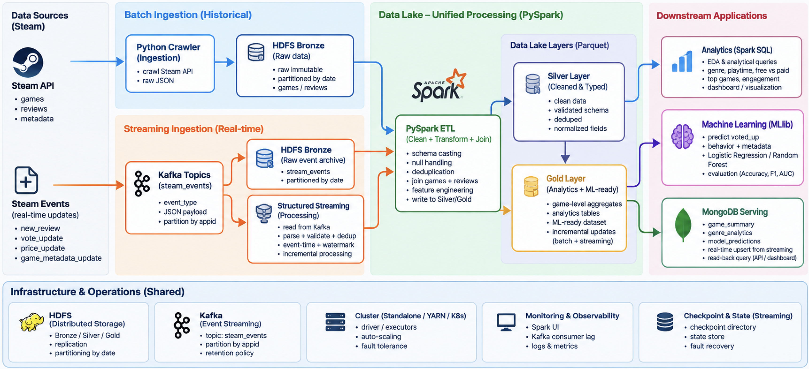

# Architecture

## Status legend

- **Implemented:** verified in the current repository/project environment
- **In Progress:** immediate engineering checkpoint
- **Planned:** intended project work with a defined role
- **Design-only:** scalable target that is not required to be fully implemented for the current experiment

## Architecture view



The image shows the shared lake and downstream processing model. The text below is the current source of truth for the newer discovery, registry, and API-polling control plane. In particular, “Steam events” are events created by our polling producer after detecting changes; Steam is not assumed to provide a native push stream.

```text
Steam API
    |
Periodic Catalog Discovery
    |
Qualification
    |
Game Onboarding Policy
    |
Game Registry / Watchlist
    |
    +-- NEW ------> Historical Backfill (Python) ------> HDFS Bronze
    |
    +-- ACTIVE ---> Incremental API Polling
                        |
                  detect changes
                        |
                      Kafka
                    /       \
                   v         v
          Raw Event Archive  Structured Streaming
              HDFS Bronze             |
                                      v
                                   Silver

HDFS Bronze
    +-- PySpark batch ETL -----------> HDFS Silver
    +-- MapReduce aggregation -------+ validate against Spark

HDFS Silver -> HDFS Gold
                   +-- Spark SQL / EDA
                   +-- Spark MLlib
                   +-- MongoDB serving
```

## Data sources

Steam supplies catalog information, game metadata, reviews, and mutable attributes such as prices or review votes. The implemented historical crawler reads Steam API responses and retains raw records. The planned streaming producer will poll the same external source and emit an internal event only when it detects a relevant change.

## Discovery and control plane

Periodic discovery identifies candidates. Qualification checks metadata completeness, review availability/volume, crawl feasibility, and diversity needs. This stage defines managed scope; it is not review cleaning, normalization, or feature engineering, and it must not select games using the ML outcome (`voted_up` or recommendation rate).

The Game Registry / Watchlist is the scalable control plane. A local JSONL registry, reconciliation step, onboarding plan, and run report are implemented for V1. `selected_50_games.jsonl` is the immutable initial research snapshot and registry seed, not a permanent maximum.

## Dynamic game onboarding

- **NEW game:** run one historical backfill, preserve raw API records, then write them to HDFS Bronze. After successful onboarding, transition the game to `ACTIVE`.
- **ACTIVE game:** poll incrementally, compare source state with known state, and create events for changes. Do not repeat a full historical crawl every discovery cycle.
- **PAUSED / RETIRED game:** optional operational states that stop normal polling while preserving history and registry lineage.

Local Discovery Control Plane V1 is **Implemented**. A production registry database/service, scheduler, and concurrent workers remain **Design-only**. The fixed 50-game cohort is **Implemented** and unchanged.

## Processing paths

The historical batch path is implemented through HDFS Bronze. PySpark Bronze-to-Silver is **In Progress**. Silver-to-Gold and MapReduce aggregation are **Planned**.

The incremental path is **Design-only**: polling creates events such as `new_review`, `vote_update`, `price_update`, and `game_metadata_update`; Kafka then feeds both an immutable Bronze archive and Structured Streaming. Batch and streaming converge on shared Silver/Gold contracts rather than creating separate analytics platforms.

## Infrastructure and operations

HDFS is the authoritative data lake. Spark uses a driver/executor model and can run under Standalone, YARN, or Kubernetes deployment options. Planned operations include Spark UI and executor logs, Kafka consumer lag, HDFS health, checkpoints, state recovery, idempotent writes, and capacity/partition monitoring. See [Deployment and Operations](10_DEPLOYMENT_AND_OPERATIONS.md).
